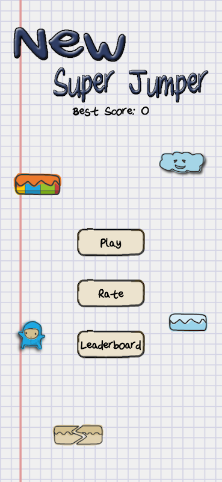
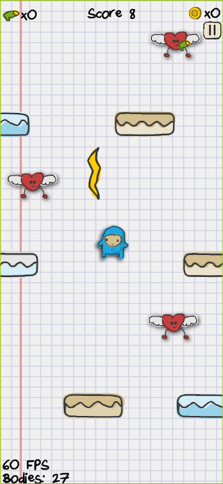
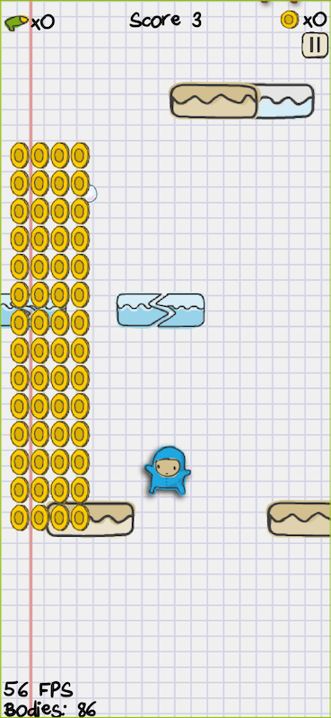
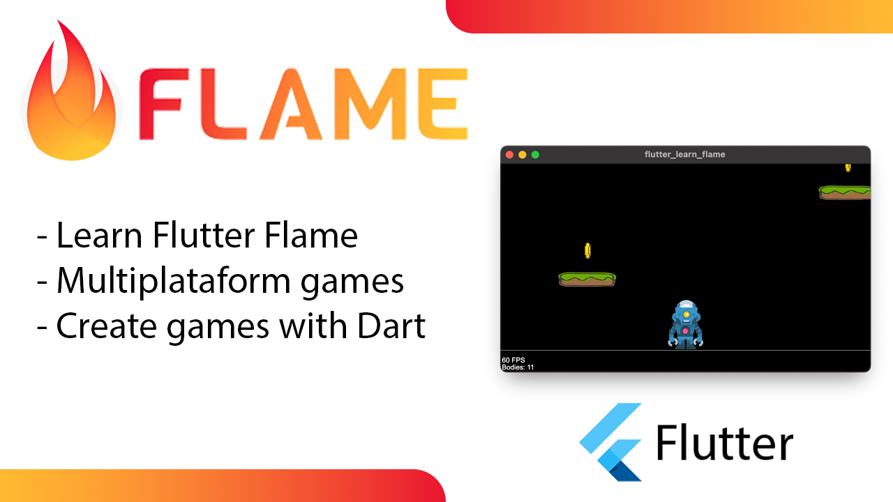
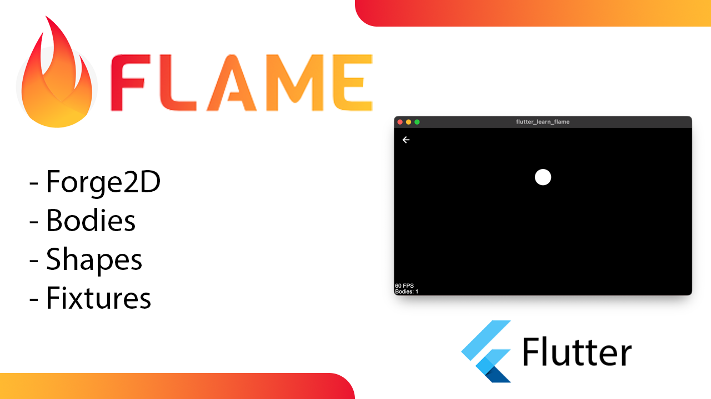
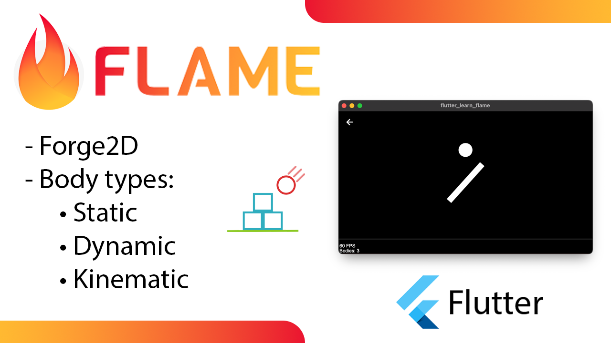
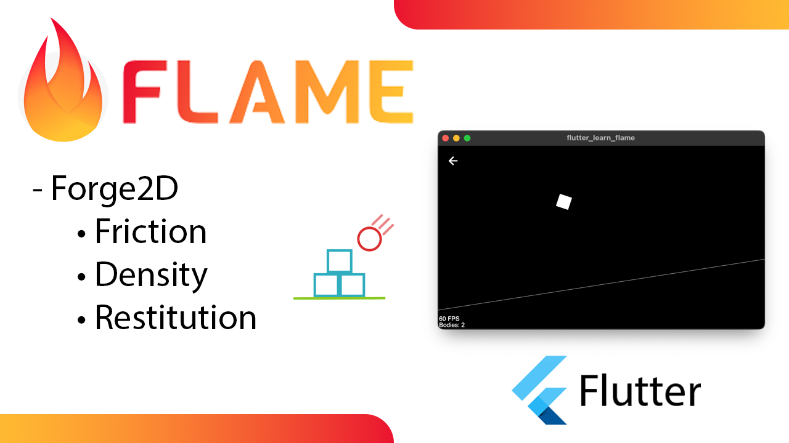
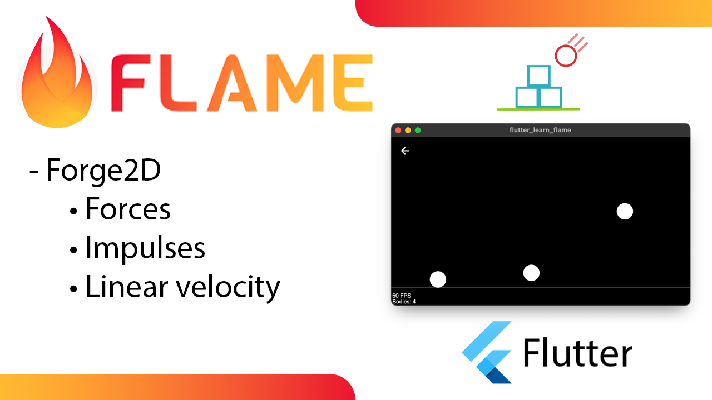
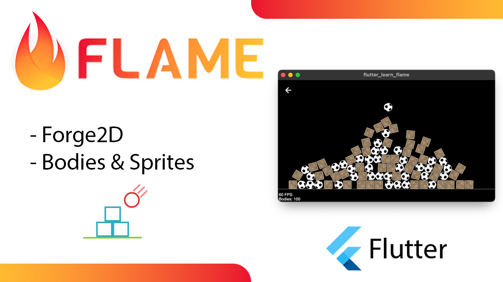
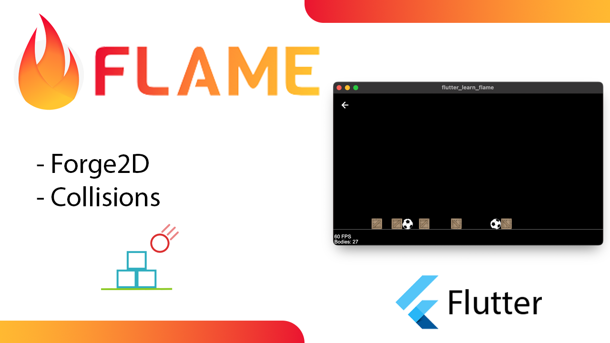

# Flutter Games Compilation

This is a compilation of Flutter Games that I used for my tutorials on my [YouTube channel](https://www.youtube.com/channel/UC9WSk7SkAXLJkT6NLg1p2cA) or my [Blog](https://www.yayocode.com/).

## Games

|                                                                                                 |                                                                                                                                                                                                     |
|-------------------------------------------------------------------------------------------------|-----------------------------------------------------------------------------------------------------------------------------------------------------------------------------------------------------|
| [New super jumper][1] Doodle Jump clone using Forge2D  [Play in your browser][3001] |     |

## Tutorials

|                                                                            |                                                                                 |
|----------------------------------------------------------------------------|---------------------------------------------------------------------------------|
|  Getting started: Setting up the project  [Read the article][5001] | [][5001] |
|  The world, bodies, shapes, and fixtures  [Read the article][5002] | [][5002] |
|  Body types: dynamic, static & kinematic  [Read the article][5003] | [][5003] |
|  Friction, density & restitution  [Read the article][5004]         | [][5004] |
|  Forces, impulses & linear velocity  [Read the article][5005]      | [][5005] |
|  Bodies and sprites  [Read the article][5006]                      | [][5006] |
|  Collisions  [Read the article][5007]                              | [][5007] |
|  Collisions with animated sprites  [Read the article][5008]        | [][5008] |

[1]: <https://github.com/Yayo-Arellano/flutter_games_compilation/tree/main/new_super_jumper> 'new_super_jumper'

<!--- 
The links must match the number of the project. Por example [1] is new_super_jumper
so here is [3001] as you can see the last digit match
-->
[3001]: <https://yayo-arellano.github.io/flutter_games_compilation/new_super_jumper/> 'new_super_jumper'

<!-- Tips -->
[5001]: <https://yayocode.com/post/XPECczhhAZgJDGcy69AO> 'article1'
[5002]: <https://yayocode.com/post/pD63d2bqXJnaRU8Er80B> 'article2'
[5003]: <https://yayocode.com/post/7hp4dLXobT8GJ3NtzVOS> 'article3'
[5004]: <https://yayocode.com/post/Gt8E8u7W9ftte6nRp1fu> 'article4'
[5005]: <https://yayocode.com/post/yPFeIgyd6Jnz8Pgby6FU> 'article5'
[5006]: <https://yayocode.com/post/91HWShtzuHkfaOj9gPP3> 'article6'
[5007]: <https://yayocode.com/post/5eL4tEcqOwlVxrtJV1BD> 'article7'
[5008]: <https://yayocode.com/post/ByfdSu012LCDKkAucB50> 'article8'